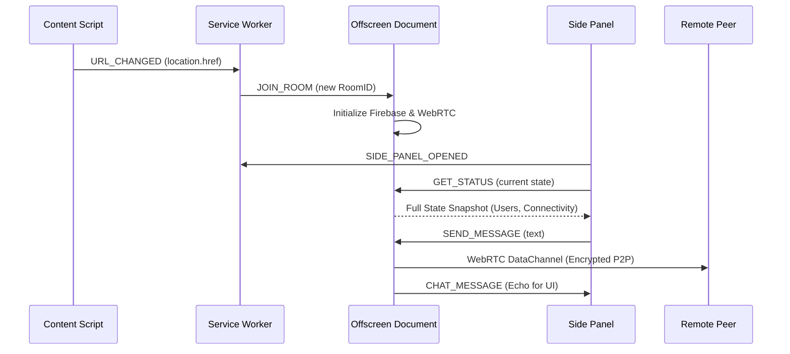
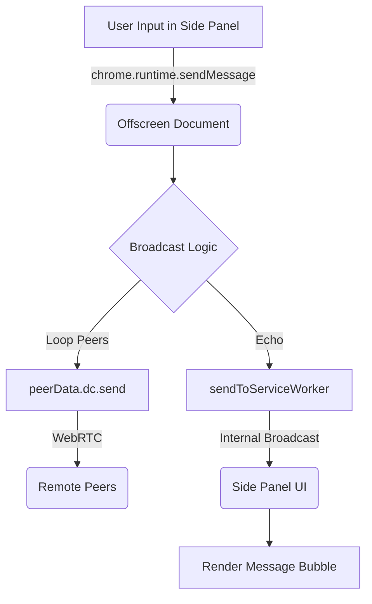

# Wormhole Developer Guide

This document outlines the technical architecture and implementation details of the Wormhole Chrome Extension.

## Architecture Overview

Wormhole is built using **Manifest V3** and leverages several modern Chrome APIs to maintain stable peer-to-peer connections.

### Components

1.  **Service Worker (`service-worker.js`):** The central orchestrator. It manages the lifecycle of the Offscreen Document, routes messages between components, and persists the global state (active room, user info) across process restarts using `chrome.storage.session`.
2.  **Offscreen Document (`offscreen/`):** Since Service Workers are ephemeral and can be terminated by Chrome at any time, the actual WebRTC connections and Firebase listeners live in an Offscreen Document. This ensures connections stay alive as long as the side panel is open.
3.  **Side Panel UI (`sidepanel/`):** The user interface. It is a "thin client" that reflects the state of the Offscreen Document. It sends user input (messages) to the background and renders incoming events (new messages, user joins).
4.  **Content Script (`content-script.js`):** Injected into every webpage to detect URL changes. It is specially designed to handle Single Page Applications (SPAs) by overriding `pushState`/`replaceState`.

## Component Communication

The following diagram illustrates how the different components interact through Chrome's messaging system and direct WebRTC channels:

## WebRTC Implementation

Wormhole uses a **Mesh Topology**. Every user in a room connects directly to every other user.

### Signaling & Negotiation
- **Signaling Server:** Firebase Realtime Database.
- **Perfect Negotiation:** To handle "glare" (when two users try to connect to each other simultaneously), we implement the Perfect Negotiation pattern. Peers use their unique IDs to determine who is "polite" (rolls back their offer) and who is "impolite" (ignores the collision).
- **Signaling Queue:** Each peer connection has an internal async queue to ensure that WebRTC descriptions (offers/answers) and ICE candidates are processed sequentially, preventing `InvalidStateError`.

### Data Channels
- Text messages are sent over `RTCDataChannel` for low-latency, peer-to-peer communication.
- Each message is assigned a unique ID for deduplication in the UI.

## Message Data Flow (Sending)

When a user sends a message, it follows this path from input to delivery:

## Data Persistence

- **Sync Storage (`chrome.storage.sync`):** Used for user profile data (nickname, user ID) so it persists across devices.
- **Session Storage (`chrome.storage.session`):** Used for temporary extension state (current room, panel open status) to survive Service Worker termination.

## Development & Build

### Build System
The project uses **esbuild** to bundle the source files. 
- Source files: `src/`
- Bundled files: `offscreen/`, `sidepanel/`, etc.
- Run `npm run build` to generate the final extension files.

### Key Logic Files
- `src/offscreen.js`: The most complex file, managing the PeerConnection state machine and Firebase signaling.
- `lib/utils.js`: Shared utilities for URL normalization and ID generation.
- `lib/webrtc-manager.js`: A modular class-based version of the connection logic (used as a reference).

## Security Note

While the WebRTC traffic is encrypted, the Firebase signaling channel requires **Security Rules** to prevent unauthorized access. Always ensure your Firebase project has rules that restrict the `signals` path to only be writeable by intended participants.
